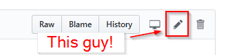

## FAQ

### I don't see what I'm looking for, is it actually missing?

[File an issue](https://github.com/ErichDonGubler/not-yet-awesome-rust/issues/new), and we'll do the research for you! :) KEEP IN MIND that this is an open-source project, and that manpower therein is limited -- the more specific you can get with your use case, the more likely it is you'll get a timely and informative response.

### I want to contribute!
### I don't see something I care about/think is {useful,important}!

If you're viewing this on the Github website, you can [edit the `README.md` file in your browser](https://github.com/ErichDonGubler/not-yet-awesome-rust/edit/master/README.md). Click the little pencil icon at the top right, and use the Markdown editor to send us a PR ASAP:

If you're not using Github...[send us a PR](https://github.com/ErichDonGubler/not-yet-awesome-rust/pulls) anyway. We want to know!

### Hey, there's something on this list, but Rust HAS something for it!

[Open an issue](https://github.com/ErichDonGubler/not-yet-awesome-rust/issues/new) so we can cross 'er out and make sure people know!
* Feel free to open an issue when you have a library that *satisfies the use cases* that are listed here -- knocking them off can only be a good thing.
    * You may also want to submit your work to [awesome-rust](https://github.com/rust-unofficial/awesome-rust), if you think it's good enough!
* For now, items will NOT be deleted from this list -- merely crossed out ~~like this~~, so people can come back and see if progress has been made on what they care about.
